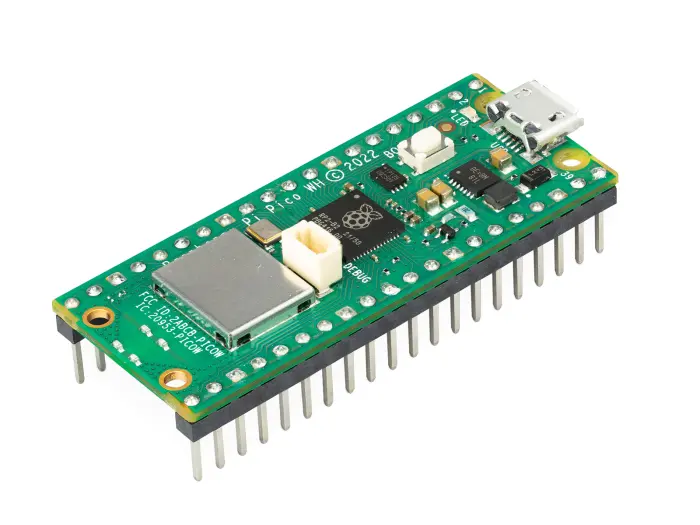
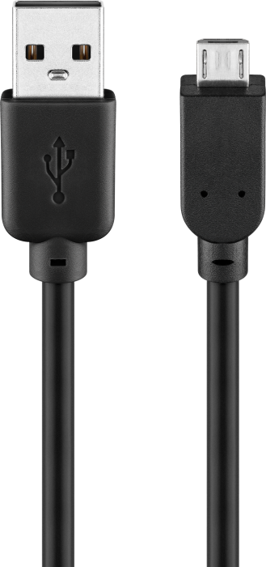
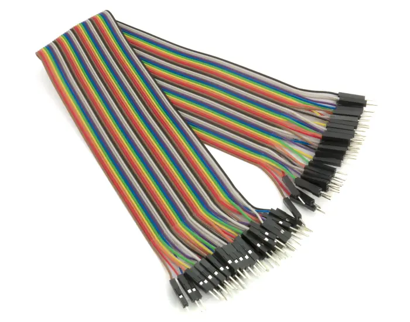
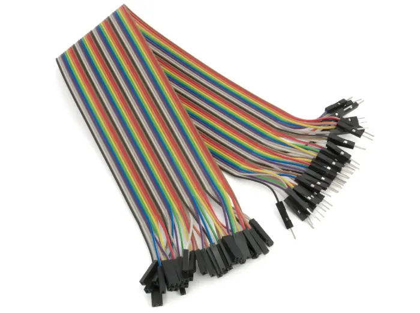
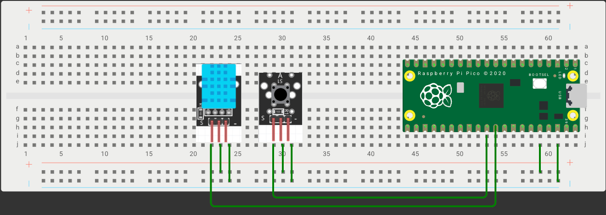
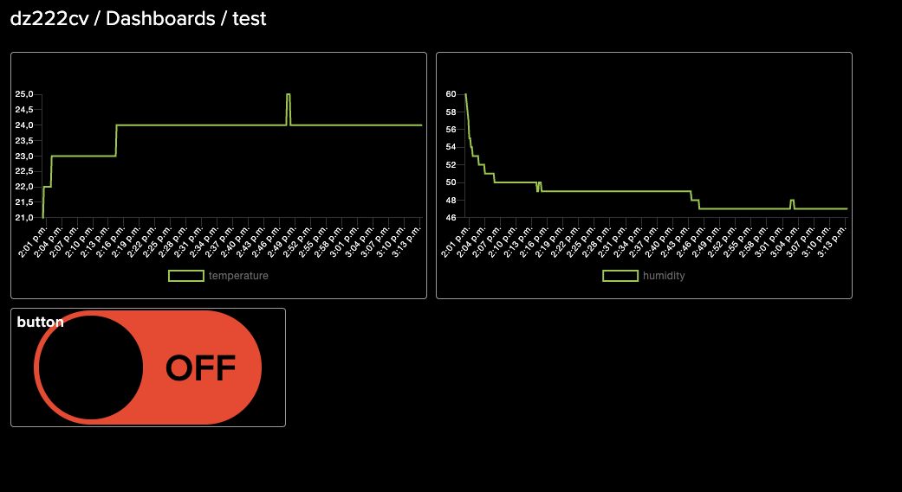

# 🌐 IoT Sensors Project

**Author:** Daniel Zak  
**StudentID:** `dz222cv`  

---

## 📌 Project Overview

This project connects a **Raspberry Pi Pico WH** with Wi-Fi capability to various sensors and displays the data on **Adafruit IO**, creating a basic but functional **Internet of Things (IoT)** system.

---

## 🕒 Project Duration

**Estimated Time:** ~4 weeks  
Includes time for:
- Exploring sensors  
- Testing hardware  
- Understanding IoT communication protocols  
- Final integration and dashboard creation

---

## 💡 Motivation

The project was created using available sensors, focusing on implementing a **button logic** that works independently of the sensor's data transmission timing—ensuring **smooth button response**.

**Observation:** Raspberry Pi Pico has some hardware limitations, such as poor compatibility with cameras or Bluetooth/USB devices. Future upgrades could involve a Raspberry Pi 5 or other boards with better expansion capabilities.

---

## 🧾 Components List

| Component | Image | Price |
|----------|-------|-------|
| Raspberry Pi Pico WH |  | 99 SEK |
| USB-A to Micro-B Cable (1.8m) |  | 39 SEK |
| Key Switch Module (50mA, 12V) |  | Included |
| DHT11 Temperature & Humidity Sensor |  | 49 SEK |
| Breadboard |  | 69 SEK |
| Male-to-Male Dupont Cables (2 pcs) |  | ~3 SEK |
| Male-to-Female Dupont Cables (6 pcs) |  | 10 SEK |

---

## 💻 Development Environment

| Item | Description |
|------|-------------|
| 💻 Computer | MacBook Pro (M3) |
| 🧠 IDE | Thonny (no extra configuration needed) |

---

## 🔌 Wiring Diagram

- **Power**: 3.3V from pin 36 to breadboard positive rail, GND from pin 38 to negative rail
- **DHT11 Sensor**:  
  - Power: Connected to breadboard power rails  
  - Data Pin: Connected to **Pin 32 (GP27)**  
- **Button Module**:  
  - Power: Connected to breadboard power rails  
  - Signal Pin: Connected to **Pin 31 (GP26)**  

---

## ☁️ Platform

### Used Platform: **Adafruit IO**

| Feature | Description |
|--------|-------------|
| Protocol | MQTT |
| Dashboard | Web-based with live visualizations |
| Tier | Free (sufficient for prototyping) |
| Remote Access | Yes – accessible via browser |

### Why Adafruit IO?

- Easy MQTT integration
- Simple dashboard creation
- Excellent documentation and community
- MicroPython-friendly

### Alternatives Considered

| Platform | Notes |
|----------|-------|
| ThingSpeak | Good visualization, limited interactivity |
| Blynk | Mobile-focused, app required |

### Future Scaling

- Upgrade to **Adafruit IO+** for more feeds/data rate
- Migrate to **AWS IoT**, **Google Cloud IoT**, or **Azure IoT** for production-ready systems

---

## 🧠 Functionality

- 📈 **Real-time** temperature and humidity data transmission
- 🔘 Button state detection (pressed/released)
- 📊 Displayed live on Adafruit IO dashboard
- 🌍 Remotely accessible

---

## 💻 The Code

- Written in **MicroPython**
- Fully documented and modular
- Separated into files:
  - `wifiConnection.py` for Wi-Fi
  - `keys.py` for Adafruit IO credentials
  - `main.py` for logic

> 📎 Code included in this repo:  
[👉 View on GitHub](https://github.com/D4nielZ4k/Internet-of-Thing-project)

---

## 📶 Connectivity

| Feature | Description |
|---------|-------------|
| 📤 Data Interval | Every 10 seconds for sensor data |
| 🔁 Event-based | Button data sent instantly |
| 📡 Network | Wi-Fi |
| 🔗 Protocol | MQTT |

---

## 📊 Dashboard & Data

### Visualizations

- 📈 **Line Graphs**: Temperature & Humidity over time
- 🟢 **Indicator**: Button ON/OFF status

### Screenshot Example

---

## 🧠 Data Frequency

| Sensor | Interval |
|--------|----------|
| DHT11 (Temp/Humidity) | Every 10 seconds |
| Button Press/Release | Immediate |

All data is stored in the **Adafruit IO Cloud**, allowing:
- Real-time visualization
- Historical trends

---

## ✅ Final Thoughts

This project provides a solid introduction to the **Internet of Things** using simple hardware and free cloud services. It's beginner-friendly and educational.

### 🧭 What’s Next?

- Add more sensors (e.g. PIR, motion, gas)
- Use a **Raspberry Pi 5** for camera support and Bluetooth
- Expand into smart home prototypes or wearable tech

---

## 🎥 Demonstration Video

👉 [Watch the demo video on YouTube](https://youtube.com/shorts/JTl-rVYX70M?si=mgNn-AFYQ3rN9Okx)
